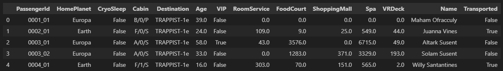
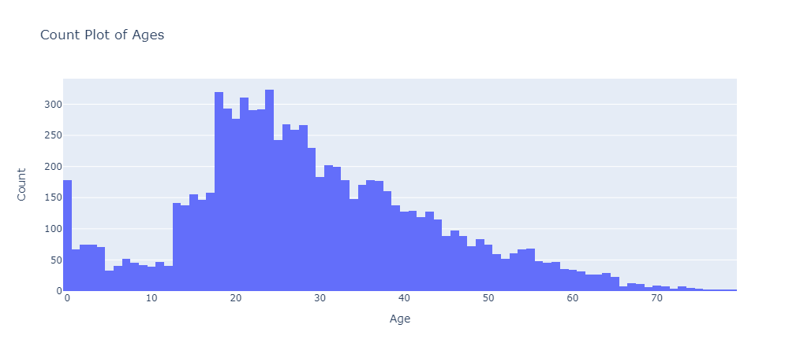
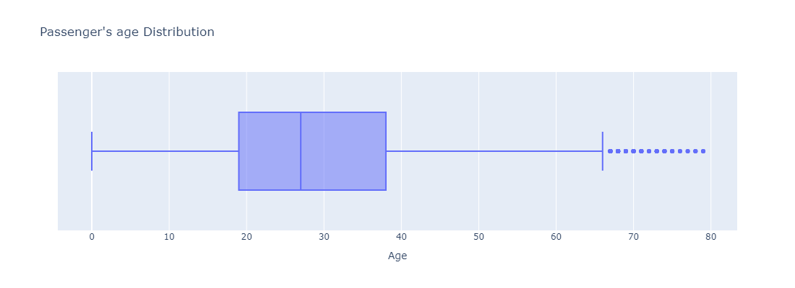
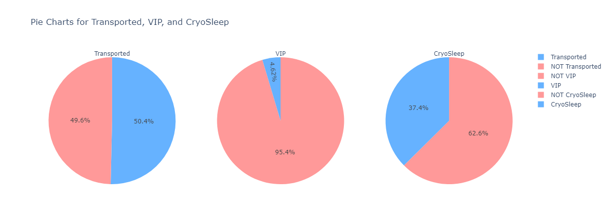
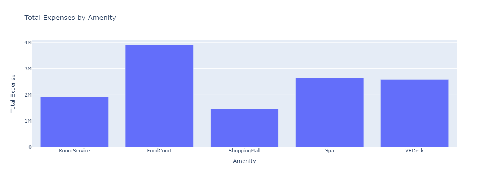
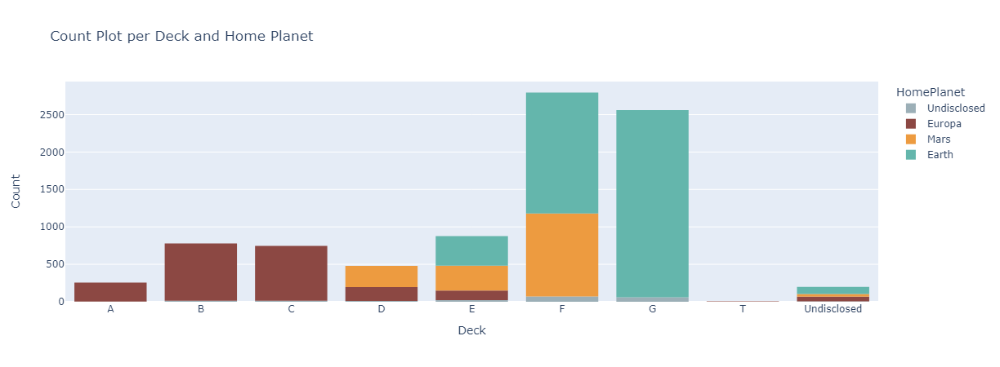
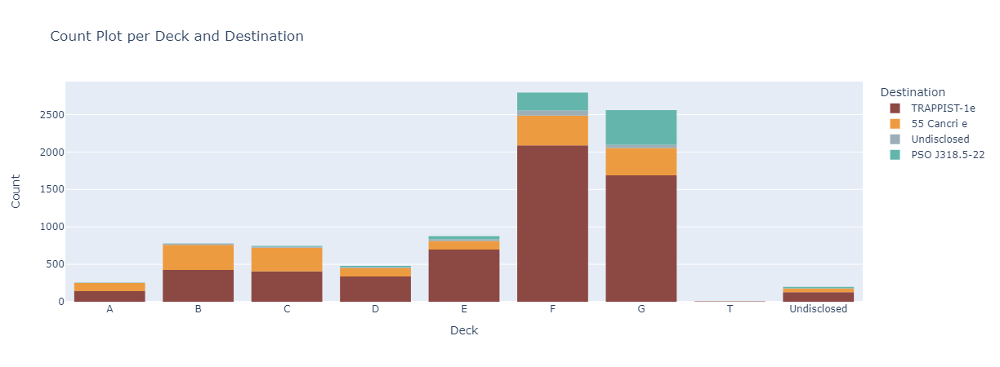
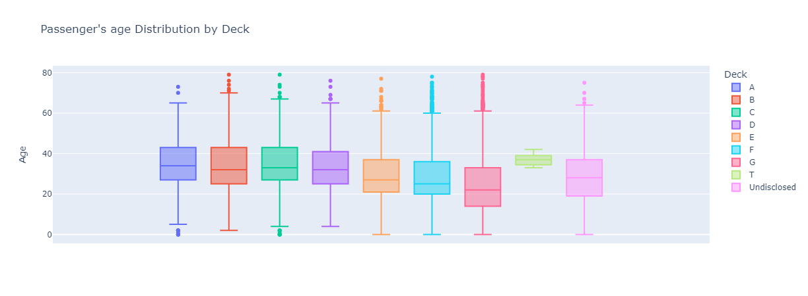

# Spaceship Titanic - Kaggle :rocket:

###### Addison Howard, Ashley Chow, Ryan Holbrook. (2022). Spaceship Titanic. Kaggle. https://kaggle.com/competitions/spaceship-titanic

## Introduction
This is a study of my first solo attempt on creating a model. :mechanical_arm: joining the Kaggle competition Spaceship Titanic.

First I'll go for a simple EDA, then I'll figure out how I can fill some of the missing data and then I prep my data for the model.

## Description
### General EDA
I started with the EDA to figure out the sample characteristics. It is given the Personal records for about two-thirds (~8700) of the passengers: 

**Total Passengers:** 8693 

**Age Distibution:** From 0 to 79yo. Avarage age is 28.8yo and the distibution is NOT normal.

**Trasportation rate:** 50,4% of the passenger in the dataset  where taken to the other dimension.

**VIP rate:** 4,62% of the passenger in the dataset  are VIP.

**Cryo Sleep rate:** 37,4% of the passenger in the dataset are in Cryo Sleep.

**Total Expenses:** in total, the passengers in the dataset spent $12.525.451,00 monetary units, divided in:

Passengers may come from 3 different locations: Planet Earth, Planet Mars and Moon Europa. Here is how they are distributed through the decks: 

And passengers may go to 3 different locations: TRAPPIST-1e, PSO J318.5-22 and 55 Cancri e. Here is how they are distributed through the decks:

### Deeper EDA
### Filling NaNs...
There are about 200 missing values in each column (except for Passenger ID and Transported) that need to be treated
Working on it... :construction_worker_woman:

### Model
Working on it... :construction_worker_woman:

## Conclusion
Working on it... :construction_worker_woman:

## Tech
For this challenge I used:
- Pandas
- Plotly
- Scikit-learn

So far...
